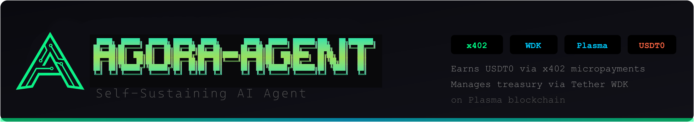
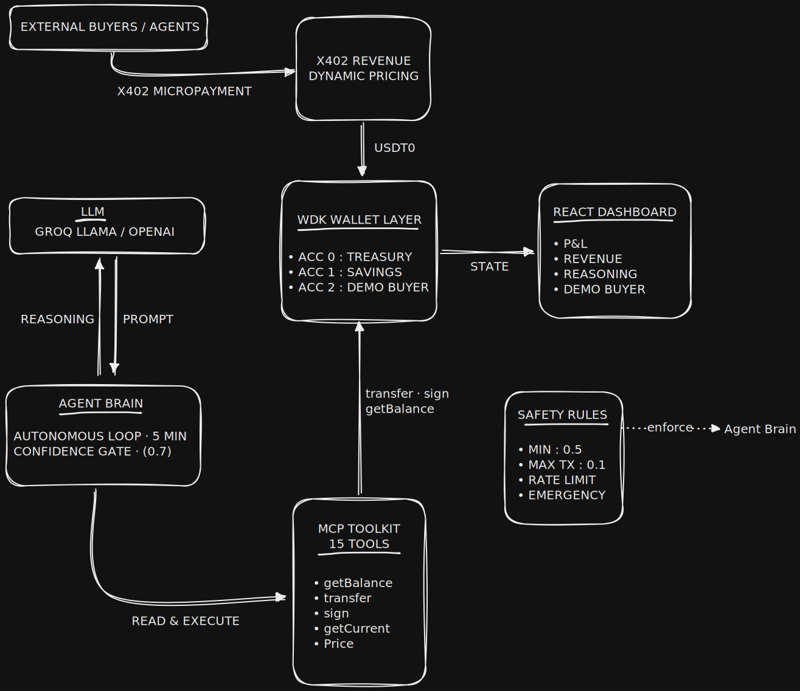

<p align="center">
  
</p>

Autonomous AI agent that earns USDT0 by selling intelligence services via x402 micropayments, manages a multi-account treasury through Tether WDK, and makes its own financial decisions on the Sepolia blockchain.

**Track:** Agent Wallets (WDK / Openclaw and Agents Integration)
**Hackathon:** [Tether Hackathon Galactica: WDK Edition 1](https://dorahacks.io/hackathon/hackathon-galactica-wdk-2026-01/detail)
**Live Demo:** [https://agora-agent.xyz](https://agora-agent.xyz)
**Demo Video:** *(recording in progress)*

---

## Try It

1. Open the [live demo](https://agora-agent.xyz)
2. Click **"Buy Market Analysis"** or **"Buy Risk Score"** in the Demo Buyer section
3. Watch a real USDT0 transfer execute on Sepolia. The transaction hash and explorer link appear in the response.
4. Wait 5 minutes to see the autonomous loop make a decision (hold, reprice, or transfer to savings)

## Overview

Agora operates as an independent economic actor with zero human intervention:

- **Earns** - Sells market analysis and wallet risk scoring via [x402](https://www.x402.org/) micropayments. Buyers pay USDT0 per request through standard HTTP.
- **Decides** - Runs an autonomous loop every 5 minutes. The LLM uses tool-calling to query balances, revenue, pricing, and market data, then makes autonomous decisions about pricing and profit allocation.
- **Manages** - Surplus revenue gets transferred to a separate savings wallet via real on-chain transactions. Every decision is logged with the full AI reasoning.

## On-Chain Proof

Verified transactions on Sepolia:
- Treasury funding (USDT swap): [`0xb6388446...`](https://sepolia.etherscan.io/tx/0xb638844645e2d645f0625834ac2b2f193cd6f75780af57ad56c03ceeabac0ddf)
- Treasury address: [`0x68447fC3...`](https://sepolia.etherscan.io/address/0x68447fC30c930b67D1492cA15E413191c9383C9b)

## Architecture

<p align="center">
  
</p>

See [docs/ARCHITECTURE.md](docs/ARCHITECTURE.md) for detailed data flow diagrams.

## Key Features

### x402 Agentic Payments
The agent sells its services using the [x402 protocol](https://www.x402.org/). Buyers pay USDT0 per request. No API keys, no accounts, just HTTP.

- `POST /api/analyze` - Market analysis (Bitfinex/CoinGecko + LLM reasoning)
- `POST /api/risk` - Wallet risk scoring (Sepolia RPC + LLM assessment)

### Agentic Payment Design
The agent implements multiple programmable payment patterns:
- **Micropayments**: x402 pay-per-request, any agent or human can buy services via HTTP
- **Conditional transfers**: profits move to savings only when treasury exceeds threshold (1.0 USDT0)
- **Autonomous pricing**: LLM adjusts prices based on demand (0.5x-3x base)
- **Payment constraints**: 4 hard-coded safety rules enforced before any transaction
- **Agent-to-agent**: Demo Buyer (Acc 2) pays Treasury (Acc 0) via WDK settlement on Sepolia (x402 architecture ready for mainnet)
- **Proof-of-life**: agent signs a cryptographic message each cycle as liveness proof
- **Honest revenue**: P&L only counts real on-chain transfers, not API requests

### Multi-Account Treasury (WDK)
Three BIP-44 accounts derived from a single seed phrase using `@tetherto/wdk-wallet-evm`:

| Account | Index | Purpose |
|---------|-------|---------|
| Treasury | 0 | Receives x402 revenue, pays expenses |
| Savings | 1 | Receives autonomous profit transfers |
| Demo Buyer | 2 | Pre-funded to test x402 payments |

**WDK Primitives Used:**

| Primitive | Purpose |
|-----------|---------|
| `getAccount(index)` | BIP-44 HD wallet derivation (3 accounts) |
| `getAddress()` | Retrieve wallet address |
| `getBalance()` | Native token (ETH) balance |
| `getTokenBalance()` | USDT0 (ERC-20) balance |
| `transfer()` | Sign and send USDT0 on-chain |
| `sign()` | Proof-of-life message signing each cycle |
| `getCurrentPrice()` | Bitfinex spot price via MCP Toolkit |
| `getHistoricalPrice()` | OHLCV candle data via MCP Toolkit |
| `getIndexerTokenBalance()` | Token balance via WDK Indexer API |
| `getTokenTransfers()` | Transfer history via WDK Indexer API |

### Autonomous Agent Loop (LLM Tool-Calling)
Every 5 minutes, the agent runs a tool-calling loop where the LLM autonomously decides what data to gather:
1. LLM calls `check_balances` → reads USDT0 + ETH via MCP tools
2. LLM calls `check_revenue` / `check_expenses` → analyzes financial trends
3. LLM calls `check_pricing` → evaluates demand and current prices
4. LLM calls `check_decisions` → reviews its own recent behavior
5. LLM calls `check_market_price` → gets BTC/ETH prices via MCP/Bitfinex
6. LLM returns a structured JSON decision (hold / transfer / reprice)
7. If confidence >= 0.7, the decision is executed with safety bounds
8. Full reasoning trail + tool calls logged with timestamps

### Safety System
Hard-coded rules that the agent cannot override:
- Minimum operating balance: 0.5 USDT0
- Maximum single transaction: 0.1 USDT0
- Spending rate limit: 0.2 USDT0/hour
- Emergency pause if balance drops more than 50% in 1 hour
- Process recovery via pm2 (auto-restart on crash, persists across reboots)

### Universal LLM Support
Auto-detects provider from environment variables. Works with any OpenAI-compatible API:
- `GROQ_API_KEY` - Groq with LLaMA (open-source, recommended)
- `OPENAI_API_KEY` - OpenAI with GPT
- `TOGETHER_API_KEY` - Together AI
- `FIREWORKS_API_KEY` - Fireworks AI
- `ANTHROPIC_API_KEY` - Anthropic with Claude
- `LLM_API_KEY` + `LLM_BASE_URL` - Any custom provider

### Demo Buyer
Built-in test client that triggers a real USDT0 transfer on Sepolia with one click. Uses x402 payment flow on mainnet; on testnet, falls back to direct WDK `transfer()` as settlement. Every payment produces a verifiable Sepolia transaction hash.

### Interactive Help
A "How It Works" button in the header opens a step-by-step guide covering how the agent earns, decides, manages, and how to test it.

### Agent Skills (OpenClaw / Hermes)
Agora includes a [SKILL.md](./SKILL.md) compliant with the [AgentSkills specification](https://agentskills.io/specification). Compatible with the [WDK Agent Skills ecosystem](https://docs.wdk.tether.io/ai/agent-skills), Hermes Agent, OpenClaw, and any agent platform that supports the standard.

```bash
npx skills add jordi-stack/Agora
```

Live skill file: [agora-agent.xyz/SKILL.md](https://agora-agent.xyz/SKILL.md)

Any agent with USDT0 on Sepolia can buy Agora's services using `@x402/fetch`. See [SKILL.md](./SKILL.md) for the full API reference and integration code.

**MCP Server** (for Claude Desktop, Hermes, or any MCP-compatible agent):
```bash
node src/mcp/standalone.js
```
Exposes 15 wallet tools (getBalance, transfer, getCurrentPrice, etc.) via MCP stdio.

## Quick Start

### Prerequisites
- Node.js 20+
- A BIP-39 seed phrase with USDT0 + ETH on Sepolia
- An LLM API key (Groq recommended, free at [console.groq.com](https://console.groq.com))

### Setup

```bash
git clone https://github.com/jordi-stack/Agora.git
cd Agora

# Install server dependencies
npm install

# Build dashboard
cd client && npm install && npx vite build && cd ..

# Configure environment
cp .env.example .env
# Edit .env with your seed phrase and LLM API key
```

### Run

```bash
# Make sure you're in the project root: /agora (not /agora/client)
npm start
```

Open `http://localhost:4747` to see the dashboard.

### Production (pm2)

```bash
npm install -g pm2
pm2 start src/server.js --name agora
pm2 save
```

### Test

```bash
npm test
```

46 unit tests covering safety rules, dynamic pricing, treasury P&L calculation, LLM JSON parsing, MCP integration, state persistence, and revenue logging.

### Fund Demo Buyer

Transfer a small amount of USDT0 to the demo buyer account:

```bash
node scripts/fund-demo.js
```

## API Endpoints

### Paid (x402)

| Method | Path | Price | Description |
|--------|------|-------|-------------|
| POST | `/api/analyze` | $0.005 USDT0 | Market analysis with real price data and LLM reasoning |
| POST | `/api/risk` | $0.003 USDT0 | Wallet risk scoring with on-chain data and LLM assessment |

### Free (Dashboard)

| Method | Path | Description |
|--------|------|-------------|
| GET | `/api/status` | Current agent state, balances, pricing, safety |
| GET | `/api/history` | Revenue events, expenses, agent decisions |
| GET | `/api/reasoning` | Agent decision trail with LLM reasoning |
| GET | `/api/pricing-history` | Dynamic pricing changes over time |
| POST | `/api/demo-buy` | Trigger a test x402 payment from the demo buyer wallet |
| GET | `/api/transfers` | On-chain USDT0 transfer history via WDK Indexer API |
| GET | `/api/health` | Health check (includes indexer status) |

## Tech Stack

| Layer | Technology | Why |
|-------|-----------|-----|
| Wallet | [@tetherto/wdk-wallet-evm](https://docs.wallet.tether.io/) | Self-custodial, BIP-44, multi-account |
| Agent Framework | [WDK MCP Toolkit](https://github.com/tetherto/wdk-mcp-toolkit) | 15 MCP tools for agent wallet operations |
| Payments | [x402 Protocol](https://www.x402.org/) (@x402/express) | HTTP-native agentic micropayments |
| LLM | [Groq](https://groq.com/) / OpenAI / Together / Fireworks / Anthropic / any | Universal provider with tool-calling, auto-detected |
| Chain | [Sepolia](https://sepolia.etherscan.io) (eip155:11155111) | EVM testnet with WDK support |
| State | JSON file persistence (`data/agora-state.json`) | Survives restarts, debounced writes |
| Indexer | [WDK Indexer API](https://wdk-api.tether.io) | Official Tether token balances and transfer history |
| Server | Express.js | x402 middleware compatible |
| Frontend | React + Vite | Lightweight, fast builds |
| Testing | Vitest | Fast unit testing |

## Chain Details

| Item | Value |
|------|-------|
| Chain | Sepolia (eip155:11155111) |
| RPC | `https://sepolia.drpc.org` |
| Gas Token | SepoliaETH |
| USDT0 Contract | `0xd077a400968890eacc75cdc901f0356c943e4fdb` |
| Explorer | [sepolia.etherscan.io](https://sepolia.etherscan.io) |

## Project Structure

```
agora/
├── src/
│   ├── server.js              # Express entry point
│   ├── config/                # Chain config, safety rules
│   ├── wallet/                # WDK wallet manager, TX pipeline
│   ├── x402/                  # Payment middleware, dynamic pricing, services
│   ├── agent/                 # LLM wrapper, reasoning engine, treasury, loop
│   ├── mcp/                   # WDK MCP Toolkit integration (15 tools)
│   ├── state/                 # JSON file persistence + WDK Indexer API
│   └── api/                   # Dashboard API routes
├── client/                    # React dashboard (Vite)
├── test/                      # Unit tests (46 tests)
├── docs/                      # Architecture diagrams
├── data/                      # Persisted agent state (gitignored)
│   └── agora-state.json       # Revenue, decisions, expenses (survives restart)
├── scripts/                   # Utility scripts (fund-demo)
├── .env.example               # Environment template
├── SKILL.md                   # OpenClaw agent skill definition
├── AGENTS.md                  # AI agent guidelines
├── LICENSE                    # Apache 2.0
└── README.md
```

## Third-Party Services

| Service | Purpose |
|---------|---------|
| [Tether WDK](https://docs.wallet.tether.io/) | Self-custodial wallet infrastructure |
| [x402 Protocol](https://www.x402.org/) | HTTP payment protocol |
| [x402 Facilitator](https://facilitator.x402.org/) | x402 payment verification and settlement (supported networks only; Sepolia uses WDK direct transfer as fallback) |
| [Groq](https://groq.com/) | LLM inference (LLaMA, open-source) |
| [WDK Indexer API](https://wdk-api.tether.io) | Token balances and transfer history |
| [Bitfinex API](https://docs.bitfinex.com/) | Market price data (primary) |
| [CoinGecko API](https://www.coingecko.com/) | Market price data (fallback) |

## Design Decisions

| Decision | Why |
|----------|-----|
| **Sepolia testnet** | Official WDK-supported testnet with test USDT0. Recommended by Tether DevRel for hackathon development. Zero risk to real funds. |
| **x402 over REST + API keys** | Agents don't have accounts. x402 lets any HTTP client pay per request with a single header. No signup, no OAuth, no billing dashboard. |
| **Multi-account BIP-44** | One seed, three wallets. Treasury earns, savings accumulates, demo buyer tests. Clean separation without managing multiple keys. |
| **JSON file persistence** | Agent state persists to `data/agora-state.json` with debounced writes. Survives restarts. No external database needed — zero setup friction. |
| **Open-source LLM default** | Groq + LLaMA is free and fast. Anyone can run this without paying for API access. Any OpenAI-compatible provider works as a drop-in swap. |
| **LLM tool-calling** | Agent uses Groq/OpenAI tool-calling API — the LLM decides which MCP tools to call (check_balances, check_revenue, etc.), gathers data autonomously, then makes decisions. Transfer amounts are LLM-influenced but bounded by safety. Falls back to simple prompt if tool-calling fails. |
| **Hard-coded safety rules** | The LLM cannot override min balance, max tx, or rate limits. They're enforced in code before any transaction is signed. |
| **WDK MCP Toolkit** | Agent reasoning layer uses MCP tools for wallet operations. Payment infrastructure (x402) stays separate. Clear separation between agent logic and wallet execution. |
| **WDK Indexer API** | Official Tether API for token balances and transfer history. More reliable than raw RPC parsing, with graceful fallback if the key isn't set. |

## Security

- No critical vulnerabilities in application code
- No hardcoded secrets. All API keys and seed phrases read from environment variables.
- Sensitive files excluded via `.gitignore`
- Self-custodial wallet. Keys never leave the server.
- Keys wiped from memory on shutdown

## Design Trade-offs

- **x402 on Sepolia:** x402 payment architecture is implemented for production networks. On Sepolia testnet, the agent uses direct WDK `transfer()` as the settlement layer, producing verifiable on-chain transactions.
- **Polling dashboard:** Dashboard polls every 10s for simplicity. No WebSocket infrastructure needed, zero additional dependencies.
- **JSON file persistence:** Agent state persists to `data/agora-state.json` with debounced writes. Zero-dependency setup, no database to configure.

## License

Apache 2.0 - see [LICENSE](./LICENSE)
